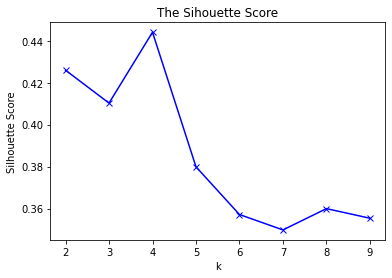
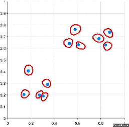

# Clustering

The three families of clustering algorithms are: 
1. __Partional__: k-means and Gaussian Mixture Models (GMM), where k-means is hard assigned version of GMMs and GMMs are able to provide probabilities
2. __Density-based__: DBSCAN and HDBSCAN.
3. __Hierarchical__: either agglomerative or divisive. These may correspond to meaningful taxonomies and a dendrogram can help find the most meaningful number of clusters.

## K-means

1. A number (_k_) of _centroids_ are initialised (centers of clusters). 
2. Each data point gets assigned to one out of _k_ clusters based on the minimal Euclidean distance between the data point and each centroid. 
3. The centroid of each cluster is recalculated to the average of the points in that cluster. 
4. Steps 2-3 are repeated until points no longer get reassigned.

### Hopkins statistic
Determine _clusterability_ using the [_Hopkins statistic_](https://en.wikipedia.org/wiki/Hopkins_statistic). Essentially, the Hopkins statistic is calculated by sampling data points from the data set in question and for each sampled point finding its nearest neighbor. The mean distances (between the sampled points and their nearest neighbors) is compared to the mean distances between nearest neighbors in a simulated dataset from a random uniform distribution. 

A value of about 0.5 means the mean distances of the original dataset and the simulated dataset are close to each other, and thus the data is uniformly distributed. It does not have a tendency to cluster. If the value of Hopkins statistic is close to zero, the dataset is clusterable.  

### Determine optimal number of clusters

- __Elbow method__: determine the elbow point of the graph, in the example it's clearly k=4. Unfortunately, the elbow is not always as sharp, i.e. the data is not as clearly clustered. 
- __Silhouette method__: in more ambiguous cases, this metric measures how similar a point is to its own cluster compared to other clusters. The range of the Silhouette value is between -1 and +1 and the higher it is, the better. 

The downside of k-means is that 
- it requires the number of clusters to be predefined.
- clusters must be circular shaped, k-means has no way of accounting for differently shaped clusters, such as oblong or elliptical. 

## Gaussian Mixture Models (GMM)

Instead of a distanced-based model (k-means), GMM uses a distribution-based model. Gaussian Mixture Models are probabilistic models and use a soft clustering approach for distributing the points in different clusters. 

K-means can be seen as a version of Gaussian Mixture Models that hard assigns the clusters. However, GMMs are - as they are distribution based - more applicable to non-circular data shapes. 

The algorithm for Gaussian Mixture Models is as follows: 
1. A number (k) of centrois are initialised.
2. For each point in the dataset, find the probability of membership in each cluster. 
3. For each cluster, update its location, normalisation, and shape based on all the data points weighted by their probability of membership to the cluster. 
4. Steps 3-4 are repeated until points no longer get reassigned. 

## DBSCAN

DBSCAN stands for *Density-Based Spatial Clustering of Applications with Noise*. Essentially, DBSCAN looks for areas of high density and assigns clusters to them, whereas points in less dense regions are not even included in the clusters and labeled as anomalies. It has two key settings:

- *eps*: maximum distance between two points to consider them as neighbors. If this distance is too large we might end up with all the points in one huge cluster, however, if it is too small we might not even form a single cluster.
- *min_points*: minimum number of points to form a cluster. If we set a low value for this parameters we might end up with a lot of really small clusters, however, a large value can stop the algorithm from creating any clusters at all.

DBSCAN looks at how many neighbors (closer than *eps*) each point has, considering neighbors all the points closer than a certain distance (eps). If more than *min_points* are neighbors, then a cluster is created, and this cluster is expanded with all the neighbors of the neighbors. Intuitively, it is important to have the input data scaled.

## Hierarchical Clustering

HDBSCAN, the abbreviation for *Hierarchical Density-Based Spatial Clustering of Applications with Noise*, is an extension of DBSCAN and and appropriate choice for more randomly distributed data. DBSCAN is performed over varying epsilon values and the result is integrated, which allows HBSCAN to find clusters of varying densities - unlike DBSCAN.  

HDBSCAN is a hierarchical, density-based clustering algorithm. There are, however, also pure hierarchical clustering algorithms. These algorithms aim to build a hierarchy of clusters and typically follow one of two approaches: 
- __Agglomerative__: a bottom-up approach where each observation starts in its own cluster and pairs of clusters are merged as one moves up the hierarchy
- __Divisive__: a top-down approach where all observations start in one cluster and splits are performed recursively as one moves down the hierarchy. 

